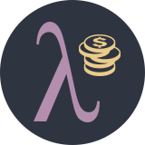

  

# Fima

## Table of contents
<!--ts-->
   * [Fima](#fima)
      * [Table of contents](#table-of-contents)
      * [Installation](#installation)
      * [Usage](#usage)
<!--te-->

---

**Fi**nance **ma**nager is a personal finance tracking service developed for personal purpose. I needed a software like this and I decided to make it in Haskell (in order to learn it).

## Installation

## Usage
